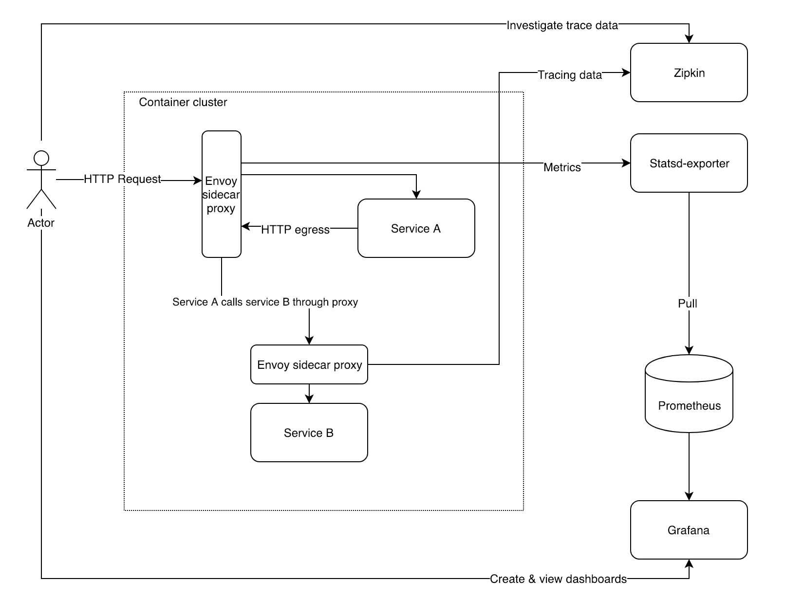

Envoy proof of concept

Example basic architecture that provides basic non functional requirements
for a micro services architecture. This includes observability, tracing,
retries, circuit breakers, metrics & graphs with minimal requirements
on the actual services. E.g. Non functional requirements are implemented
outside the Spring Boot 2 based micro services as much as possible.

Goals of POC:
- Deploy two service, A & B
- Both services have a envoy side car proxy container that traffic is proxied through
- Service A calls service B
- Automated retries on 5xx responses
- Use circuit breakers, e.g. no cascading failures if B is down or we
  are overloaded with traffic
- Zipkin tracing
- Metrics for all incoming and outgoing HTTP requests

TODO
- Both services protected with rate limiting

### Notes

- Installing envoy on top of vanilla openjdk alpine images requires glibc,
  - https://github.com/sgerrand/alpine-pkg-glibc
- Restart service after changes:
 docker-compose up -d --build service-a

### References

Circuit breaking
- http://blog.christianposta.com/microservices/01-microservices-patterns-with-envoy-proxy-part-i-circuit-breaking/

Tracing
 - http://blog.christianposta.com/microservices/03-microservices-patterns-with-envoy-proxy-part-iii-distributed-tracing/

Metrics
 - https://hackernoon.com/microservices-monitoring-with-envoy-service-mesh-prometheus-grafana-a1c26a8595fc
 - https://github.com/cloudposse/prometheus-to-cloudwatch

